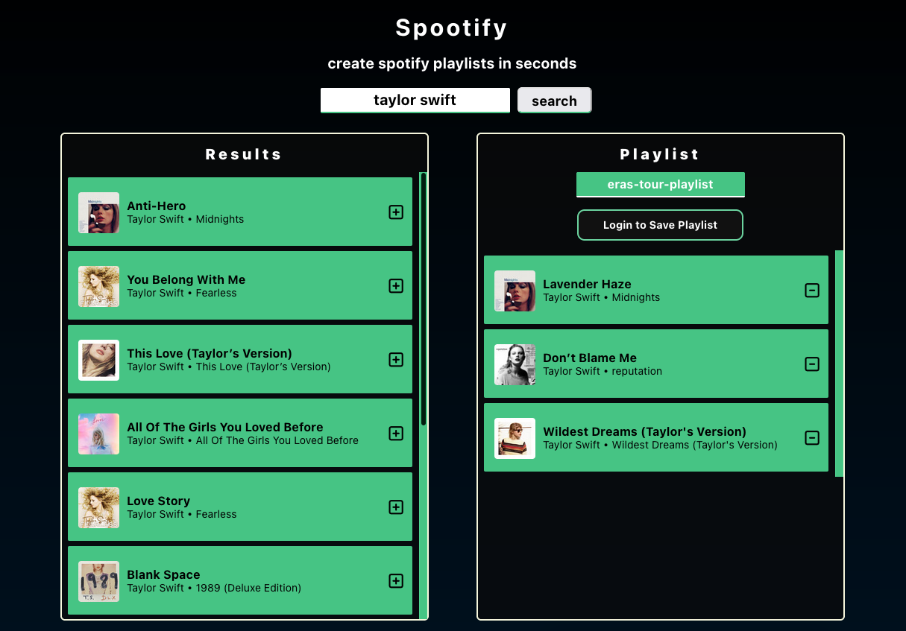
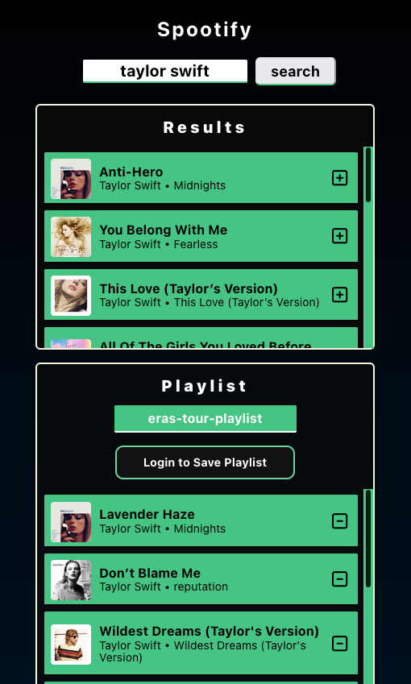
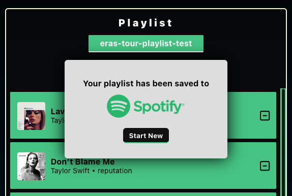
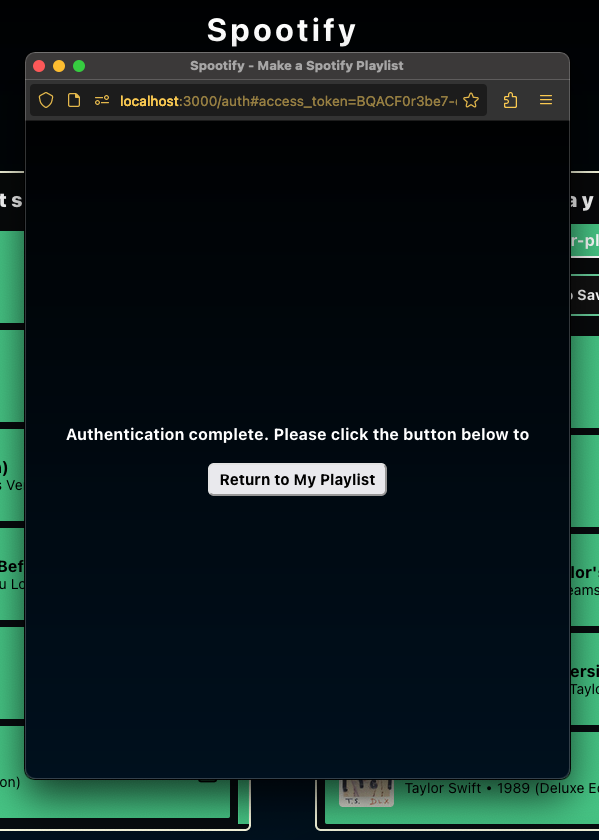

# Spootify - Make a Spotify Playlist

Front-end Engineering project. Make Spotify playlists in seconds.
An upgraded version of Codecademy's project "Playlist App With the Spotify API".

---
> This application is using Spotify's Development Mode, this will not work for all Spotify accounts (max limit 25), so if you would like to try this demo please contact the [author](#author).

---

## Content

1. [Overview](#overview)
    - [Technologies Used](#technologies-used)
    - [Main Concepts](#main-concepts)
2. [Logic](#logic)
    - [React Components](#react-components)
3. [Author](#author)
4. [Screenshots](#screenshots)

## Overview

### Technologies Used
- React (Front-End)
    - react-router-dom
    - craco
- JavaScript
    - fetch api calls
    - local storage
- Spotify API

### Main Concepts
- async fetch api calls
        try{
            fetch () ... 
        } catch(e) { }
- react reusable function components
- react useState and useEffect

## Logic
### React Components

| Main  | | 
| ------ | ----- |
| Search Results | Tracklist|
| Track | Track |
| Track | Track |
| Track | Track |
| Track |  |

There are 7 main react components that allow for this app to work, all in tandem. The infrastructure is all built around the most important component **"Track"**.
This "Track" component holds the song's attributes such as title, artist, album, id, and (most importantly for Spotify) the song's URI.
The **"Tracklist"** component holds all the tracks that the user has added to their playlist, while the **"Search Results"** component holds the top 10 tracks that Spotify API fetched from the query (either user input or initial state, set to "taylor swift"). These two track containers are almost identical except by their "add" and "remove" track buttons.
**"Authentication"** is a separate component that is being served at '/auth' and helps with user authorization to the Spotify api that gives us access to create and publish playlists.

    

## Author
- LinkedIn: [linkedin.com/in/alex-laris](https://www.linkedin.com/in/alex-laris/)
- Website [alexdemos.net](https://alexdemos.net/)
- Email [contact@alexdemos.net](mailto:contact@alexdemos.net)

## Screenshots
Mobile version:
---

Saved Playlist:
---

After Spotify Authorization:
---

